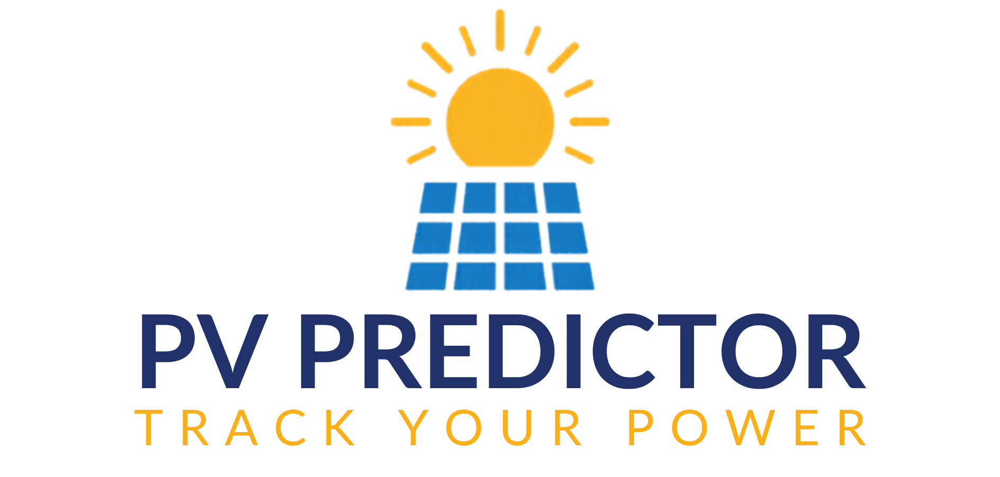

# ☀️ PV Power Output Predictor (ML System + Web App)

A production-ready machine learning system for predicting photovoltaic (PV) power output using temperature and irradiance.

This project combines:

* end-to-end ML pipeline design
* experiment tracking with **MLflow**
* modular architecture using `src/` layout
* a deployable Flask web application
* modern dependency management with **uv**

---

🌍 Live Demo

👉 [View App on Render](https://pv-predictor.onrender.com)

---

## Features

* Predict PV power output from environmental inputs
* Experiment tracking and model versioning (MLflow)
* Clean project structure (`src/`, `scripts/`, `config/`)
* Web interface (Flask) with dark mode UI
* Reproducible environment (uv)

---

## How It Works

1. Data is loaded from `data/raw/`
2. Features (temperature, irradiance) are scaled using `StandardScaler`
3. A neural network (`MLPRegressor`) is trained
4. Experiments are logged with MLflow
5. The trained model is saved in `outputs/models/`
6. Flask app loads the model and serves predictions

In brief:
```
Input (Temp, Irradiance)
        ↓
Feature Scaling
        ↓
MLPRegressor Model
        ↓
MLflow Tracking
        ↓
Saved Model (outputs/)
        ↓
Flask App → Prediction UI
```

---

## Project Structure

```bash id="readme-tree"
pv-predictor/
├── app/                # Flask web app
├── config/             # YAML configs
├── data/raw/           # input dataset
├── mlruns/             # MLflow experiments (ignored in prod)
├── outputs/models/     # trained model + scaler
├── scripts/            # training pipeline
├── src/pv_predictor/   # core ML logic
├── notebooks/          # exploration
├── pyproject.toml      # dependencies (uv)
└── README.md
```

---

## Setup (with uv)

```bash id="setup-uv"
uv sync
```

---

## Train the Model

```bash id="train-cmd"
python scripts/02_train_model.py
```

---

## Run MLflow UI

```bash id="mlflow-ui"
mlflow ui
```

Then open: [http://localhost:5000](http://localhost:5000)

---

## Run the Web App

```bash id="run-app"
python app/app.py
```

Visit: [http://127.0.0.1:5001](http://127.0.0.1:5001)

---

## Deployment

This app can be deployed on:

* **Render** (recommended for Flask apps)
* **Streamlit** (for dashboard-style apps)

### Render Start Command:

```bash id="render-start-readme"
gunicorn app.app:app --bind 0.0.0.0:$PORT
```

---

## Tech Stack

* Python (Flask, scikit-learn, pandas, NumPy)
* MLflow (experiment tracking)
* uv (dependency management)
* HTML/CSS (custom UI with dark mode)

---

## Future Improvements

* Add PV performance metrics (PR, efficiency)
* Integrate anomaly detection (UMAP, LOF)
* Forecasting (LSTM / sklearn)
* Build interactive dashboard (Streamlit)
* Load models directly from MLflow registry

---

## Preview



---

### 📊 Sample Prediction

**Input:**
Temperature = 25°C
Irradiance = 800 W/m²

**Output:**
Predicted Power ≈ 0.82 kW

---

## 🔄 Project Evolution

- **v1 (Prototype):** Simple Flask app with static model  
- **v2 (Current):** Full ML system with:
  - modular pipeline (`src/`)
  - experiment tracking (MLflow)
  - reproducible environment (uv)
  - production-ready deployment

---

## Author

Built as part of a machine learning + photovoltaic systems project.

---
